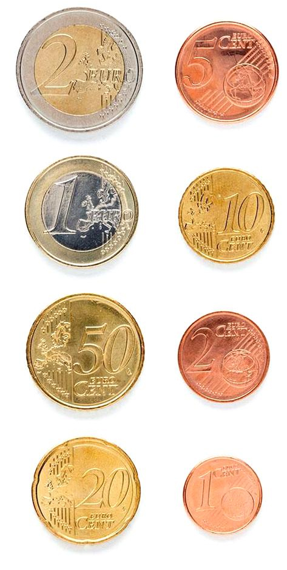
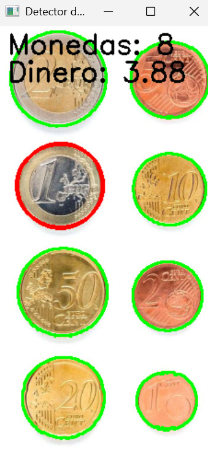
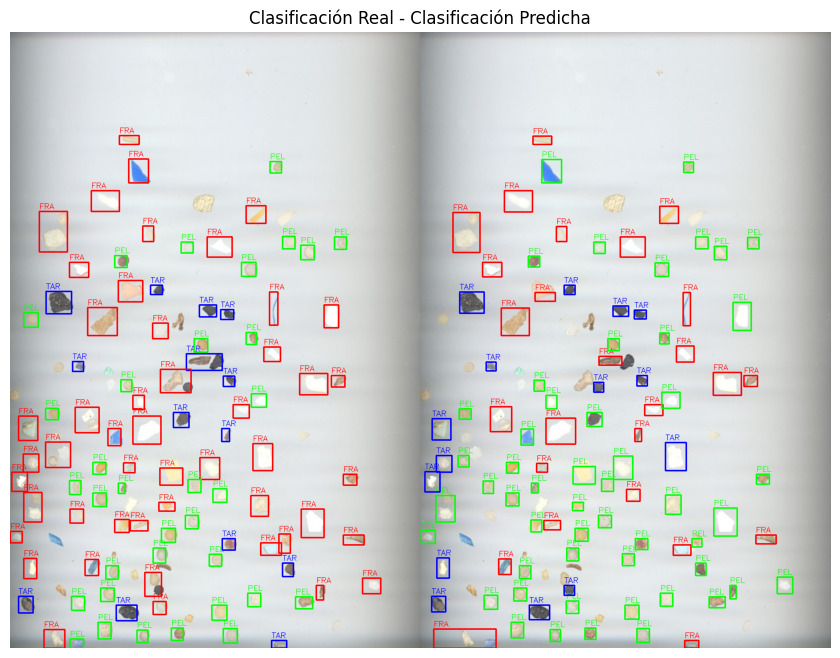

# Detección y reconocimiento de formas

## Descripción del trabajo
Este repositorio con tiene dos ejercicios de visión por computador desarrollados en Python con la librería OpenCV. Cada uno trata un problema distinto de análisis de imágenes.

1. **Contador de dinero** que hay en una imagen:
En este ejercicio se ha desarrollado un sistema capaz de calcular la cantidad total de dinero presente en una imagen con monedas. Para su correcto funcionamiento se debe de hacer click en la moneda de un euro en la imagen, esto es porque esta moneda es la que se usa como referencia para calcular el valor de las demás.

  
  

2. **Clasificador heurístico de partículas**:
Este proyecto se enfoca en la construcción de un clasificador para distintos tipos de microplásticos (FRA, PEL, TAR) según sus características intrínsecas.

---

## Autoría

Este trabajo ha sido realizado por **Juan Francisco del Rosario Machin** y **Mario García Abellán**, como parte de una práctica de procesamiento de imágenes en el entorno académico.

---

## Fuentes y referencias

Durante el desarrollo de la práctica se consultaron o utilizaron las siguientes fuentes:

- Documentación oficial de OpenCV: [https://docs.opencv.org](https://docs.opencv.org)
- [Stack Overflow](https://stackoverflow.com/)
- Consultas a [ChatGPT](https://chatgpt.com/)