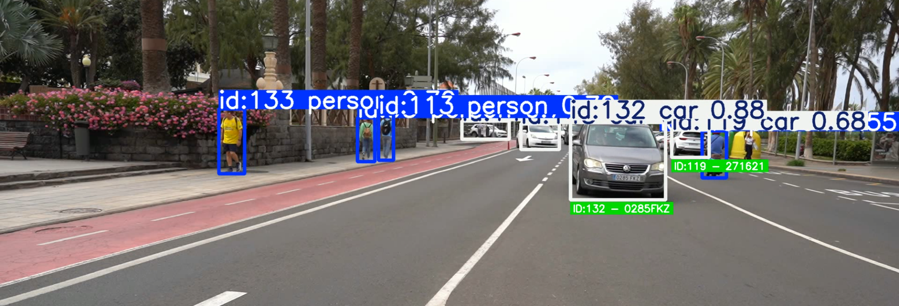
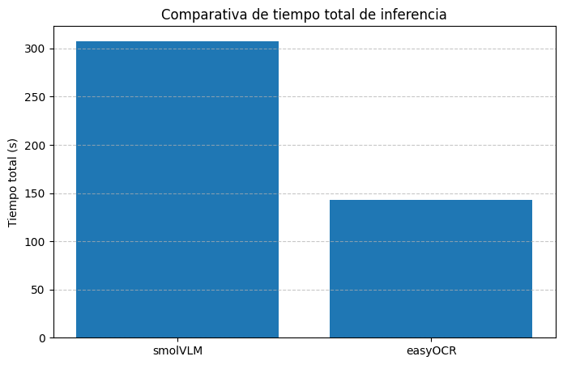
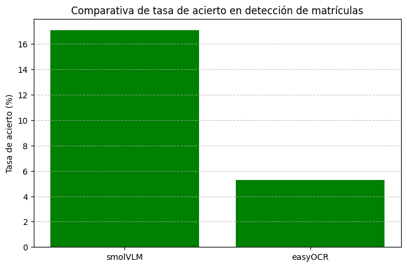

# Práctica 4. Detección de vehículos y matrículas

## Contenidos

- [Descripción](#descripción)
- [Configuración del entorno](#configuración-del-entorno-con-conda)
- [Detección de matrículas basada en contornos](#detección-inicial-de-matrículas-basada-en-contornos)
- [Entrenamiento de un modelo YOLO para la detección de matrícula](#entrenamiento-de-un-modelo-yolo-para-la-detección-de-matrículas)
- [Estructura del código y funcionamiento general](#estructura-del-código-y-funcionamiento-general)
    - [Funciones de extracción de texto OCR](#funciones-de-extracción-de-texto-ocr)
    - [Función principal](#función-principal-procesar_videomodelo_ocr-str)
- [Comparativa de modelos OCR: SmolVLM vs EasyOCR](#comparativa-de-modelos-ocr-smolvlm-vs-easyocr)
- [Autoría](#autoría)
- [Fuentes y referencias](#fuentes-y-referencias)


## Descripción
 
El presente proyecto tiene como objetivo la **detección de vehículos y personas** mediante el uso de un modelo **YOLOv11** preentrenado, así como la **detección y reconocimiento de matrículas** utilizando un modelo YOLO personalizado.

Para la detección de matrículas, se ha entrenado un modelo YOLO propio empleando un **dataset combinado** entre uno disponible en **Kaggle** y otro recopilado por los estudiantes de la asignatura **Visión por Computador (VC) 2025/2026**, alojado en **Google Drive**.

Una vez detectadas las matrículas, el proyecto aplica dos enfoques distintos para la **extracción del texto (número de matrícula)**:

- **SmolVLM**, un modelo de lenguaje multimodal ligero.  
- **easyOCR**, una librería de reconocimiento óptico de caracteres.

El objetivo principal es **comparar ambos métodos** en términos de **tiempo de inferencia** y **tasa de acierto**, evaluando su desempeño en diferentes condiciones y estableciendo cuál resulta más eficiente y preciso para el reconocimiento de matrículas en entornos reales.

## Configuración del entorno con Conda

Para ejecutar correctamente el cuaderno de este proyecto, es recomendable crear un entorno virtual con **Conda** que contenga todas las dependencias necesarias.

### Crear el entorno

Ejecuta los siguientes comandos en tu terminal o en Anaconda Prompt:

```bash
conda create --name VC_P4 python=3.9.5
conda activate VC_P4
pip install ultralytics
pip install lap
pip install opencv-python pillow torch torchvision torchaudio transformers easyocr numpy pandas matplotlib
```

## Detección inicial de matrículas basada en contornos

En esta primera fase del proyecto se lleva a cabo un **proceso experimental de detección de matrículas** a partir de un vídeo, utilizando un modelo **YOLOv11** preentrenado para detectar vehículos y personas.  

El propósito principal de esta etapa es **intentar localizar las matrículas de forma manual mediante procesamiento de imagen**, sin depender todavía de un modelo entrenado específicamente para ello. De esta manera, se busca **evaluar la efectividad y las limitaciones** de un enfoque basado únicamente en transformaciones visuales y análisis geométrico.

Una vez detectados los vehículos con YOLOv11, se aplica un proceso de **tratamiento de imagen clásico** sobre cada región correspondiente a un vehículo, que incluye:

- Conversión a escala de grises.  
- Suavizado mediante filtro Gaussiano para reducir ruido.  
- Umbralización adaptativa para resaltar bordes.  
- Detección y análisis de contornos.  

Los contornos obtenidos se evalúan en función de criterios como su **relación de aspecto**, **área relativa** y **proporción geométrica**, con el objetivo de seleccionar aquel que más se asemeje a una matrícula real.  

Durante el proceso, el sistema muestra los resultados en tiempo real, dibujando recuadros sobre los vehículos y las posibles matrículas detectadas, permitiendo observar **visualmente los aciertos y los errores**.

## Entrenamiento de un modelo YOLO para la detección de matrículas

Tras la fase inicial de detección manual, se desarrolla una **segunda etapa** en la que se **entrena un modelo YOLO personalizado** con el fin de detectar matrículas de manera más precisa y automatizada.

Para ello, se utiliza un **dataset combinado**, compuesto por:

- Un conjunto de [imágenes obtenido de **Kaggle**](https://www.kaggle.com/datasets/fareselmenshawii/large-license-plate-dataset), especializado en la detección de matrículas.  
- Un conjunto adicional de [imágenes recopiladas por los **estudiantes de la asignatura de Visión por Computador (VC) 2025/2026**](https://drive.google.com/drive/folders/1FaHHGn4XlpjYOFe-2kCk8cHs3wnOyZk6), almacenadas en un **Google Drive compartido**.

El proceso consiste en **cargar un modelo YOLOv11 preentrenado** y realizar un **entrenamiento adicional** con el dataset preparado. Durante el entrenamiento se configuran parámetros como:

- Número de épocas.  
- Tamaño de las imágenes.  
- Tamaño del batch.  
- Dispositivo de cómputo (CPU o GPU).  

Una vez finalizado el entrenamiento, se genera un modelo optimizado para la **detección específica de matrículas**, denominado `yolo_matriculas`.  
Posteriormente, se realiza una **fase de validación**, en la cual el modelo se aplica sobre las imágenes del conjunto de validación para comprobar su rendimiento y visualizar los resultados.

## Estructura del código y funcionamiento general

El código del proyecto está diseñado de forma **modular y basada en funciones**, lo que permite realizar comparaciones de rendimiento entre distintos modelos de reconocimiento óptico de caracteres (OCR) de manera estructurada y reproducible.

---

### Funciones de extracción de texto OCR

Existen dos funciones principales encargadas de **extraer el texto de las matrículas detectadas** en los frames del vídeo.  
Ambas funciones reciben como entrada el **frame completo** y las **coordenadas del rectángulo** que encierra la matrícula, previamente obtenidas mediante el modelo YOLO entrenado.  
Su salida es el **texto reconocido** en la región de la matrícula.

- **`extraer_texto_matricula_easyOCR(frame, x1, y1, x2, y2)`**  
  Utiliza la librería **EasyOCR**, un sistema basado en redes neuronales ligeras diseñado específicamente para **reconocimiento óptico de texto** en imágenes.  
  EasyOCR es eficiente y fácil de implementar, funcionando bien en tiempo real, aunque puede verse afectado por variaciones de iluminación o inclinación en las matrículas.  

- **`extraer_texto_matricula_smolVLM(frame, x1, y1, x2, y2)`**  
  Emplea el modelo **SmolVLM**, un modelo **multimodal de visión y lenguaje** que combina capacidades de análisis visual con comprensión semántica.  
  A diferencia de EasyOCR, SmolVLM no se limita a detectar caracteres, sino que **interpreta la escena visual** y puede ofrecer **mayor robustez ante imágenes borrosas o parcialmente visibles**, aunque a costa de un mayor tiempo de inferencia.

El propósito de incluir ambas funciones es **comparar los resultados** obtenidos con cada modelo, tanto en **precisión de reconocimiento** como en **tiempo de procesamiento**.

---

### Función principal: `procesar_video(modelo_ocr: str)`

La función `procesar_video()` constituye el **núcleo del sistema de evaluación**.  
Su objetivo es procesar un vídeo completo, detectando vehículos, localizando matrículas y extrayendo el texto correspondiente usando el modelo OCR especificado.

#### Parámetro de entrada:
- `modelo_ocr (str)`: indica qué sistema OCR utilizar, pudiendo ser `'easyOCR'` o `'smolVLM'`.

#### Proceso general:
1. **Validación del modelo seleccionado** para asegurar que el parámetro sea correcto.  
2. **Inicialización del seguimiento de objetos (tracking)** y detección de vehículos mediante el modelo YOLO entrenado.  
3. **Procesamiento frame a frame**, donde se detectan matrículas dentro de cada vehículo.  
4. **Extracción del texto** de las matrículas usando la función correspondiente al modelo OCR elegido.  
5. **Asociación de matrículas a vehículos**, manteniendo un registro del mejor resultado para cada uno.  
6. **Creación de un vídeo de salida** con las detecciones y etiquetas visuales.

7. **Generación de un archivo CSV** que resume toda la información del procesamiento (vehículos, matrículas, coordenadas, confianza, etc.).
```csv
track_id, tipo_vehiculo, conf_vehiculo, frame_primera_aparicion, frame_ultima_aparicion, matricula_detectada, texto_matricula, conf_matricula, frame_mejor_deteccion, vehiculo_x1, vehiculo_y1, vehiculo_x2, vehiculo_y2, matricula_x1, matricula_y1, matricula_x2, matricula_y2
```
De manera complementaria, se ha añadido al archivo CSV un bloque resumen con estadísticas agregadas sobre los objetos detectados y su comportamiento durante el video:
```csv
Conteo por clase
Vehículos que salen por la izquierda
Vehículos que salen por la derecha
Personas que salen por la izquierda
Personas que salen por la derecha
```

8. **Cálculo de métricas estadísticas** como:
   - Tiempo total de procesamiento.  
   - Tiempo medio por frame.  
   - Número de vehículos detectados.  
   - Número de matrículas correctamente reconocidas.  
   - Tasa de acierto global del modelo OCR.

#### Resultado:
La función devuelve un **diccionario resumen** con todas las estadísticas relevantes, lo que permite **comparar objetivamente el desempeño** de ambos modelos (EasyOCR vs SmolVLM) en cuanto a:
- **Precisión de reconocimiento.**
- **Velocidad de inferencia.**
---

## Comparativa de modelos OCR: SmolVLM vs EasyOCR

En esta última fase del proyecto se realiza una comparativa entre los dos modelos OCR utilizados: **SmolVLM** y **EasyOCR**.  
Ambos modelos se aplican al mismo [video de test](https://alumnosulpgc-my.sharepoint.com/personal/mcastrillon_iusiani_ulpgc_es/_layouts/15/stream.aspx?id=%2Fpersonal%2Fmcastrillon%5Fiusiani%5Fulpgc%5Fes%2FDocuments%2FRecordings%2FC0142%2EMP4&ga=1&referrer=StreamWebApp%2EWeb&referrerScenario=AddressBarCopied%2Eview%2E82ce6fe3%2D70f5%2D4ff7%2Dab2b%2D7e868b9e33b4) mediante la función `procesar_video()`, que devuelve métricas clave como:

- **Tiempo total de procesamiento**
- **Tiempo medio por fotograma**
- **Tasa de acierto en detección de matrículas**

El objetivo es **evaluar el rendimiento y precisión de cada modelo** bajo las mismas condiciones, analizando sus fortalezas y limitaciones.

---

### Gráficas comparativas

**1. Tiempo total de inferencia (s):**  
Evalúa la eficiencia computacional de cada modelo.  
SmolVLM tarda más del doble que EasyOCR en procesar el mismo video, lo que indica una mayor carga computacional.

**2. Tasa de acierto en detección de matrículas (%):**  
Mide el porcentaje de matrículas correctamente detectadas y reconocidas.  
SmolVLM supera a EasyOCR en precisión, con una tasa de acierto más de tres veces superior.




---

### Tabla resumen

| Modelo   | Tiempo total (s) | Tiempo medio por frame (s) | Tasa de acierto (%) |
|----------|------------------|-----------------------------|----------------------|
| SmolVLM  | 307.737          | 0.1087                      | 17.11                |
| EasyOCR  | 143.028          | 0.0505                      | 5.26                 |

---

### Análisis y conclusiones

Los resultados muestran un claro **trade-off entre precisión y eficiencia**:

- **SmolVLM** destaca por su capacidad de detección, logrando identificar correctamente un mayor número de matrículas. Esto sugiere que su arquitectura está mejor adaptada a tareas complejas de visión por computadora, posiblemente gracias a un modelo más profundo o técnicas de atención más avanzadas. Sin embargo, esta precisión viene acompañada de un coste computacional elevado, con un tiempo de inferencia más del doble que EasyOCR.

- **EasyOCR**, por otro lado, ofrece una solución mucho más rápida y ligera. Su tiempo medio por fotograma es inferior a 0.05 segundos, lo que lo convierte en una opción ideal para aplicaciones en tiempo real o dispositivos con recursos limitados. No obstante, su tasa de acierto es considerablemente más baja, lo que puede comprometer la fiabilidad del sistema en entornos exigentes.

#### Consideraciones adicionales:

- Si el objetivo del sistema es **maximizar la precisión** en contextos donde el tiempo de procesamiento no es crítico (por ejemplo, análisis offline o auditorías), **SmolVLM** es claramente superior.
- Si se prioriza la **velocidad y eficiencia**, como en sistemas embebidos o aplicaciones móviles, **EasyOCR** puede ser más adecuado, aunque se debe considerar un posible aumento en falsos negativos.
- Una opción interesante sería explorar **modelos híbridos**, donde EasyOCR actúe como filtro rápido y SmolVLM se aplique solo en casos dudosos o de baja confianza.

---

## Autoría

Este trabajo ha sido realizado por Juan Francisco del Rosario Machin y Mario García Abellán, como parte de una práctica de procesamiento de imágenes en el entorno académico.

## Fuentes y referencias

Durante el desarrollo de la práctica se consultaron o utilizaron las siguientes fuentes:

- Documentación oficial de OpenCV: [https://docs.opencv.org](https://docs.opencv.org)
- Consultas realizadas a [ChatGPT](https://chatgpt.com/)
- Repositorio oficial de EasyOCR: [https://github.com/JaidedAI/EasyOCR](https://github.com/JaidedAI/EasyOCR)
- Artículo sobre SmolVLM en Hugging Face: [https://huggingface.co/spaces/ashkamath/smol-vlm](https://huggingface.co/spaces/ashkamath/smol-vlm)
- Documentación de pandas para análisis de datos: [https://pandas.pydata.org/docs/](https://pandas.pydata.org/docs/)
- Matplotlib para generación de gráficas: [https://matplotlib.org/stable/contents.html](https://matplotlib.org/stable/contents.html)


[Volver arriba](#práctica-4-detección-de-vehículos-y-matrículas)

