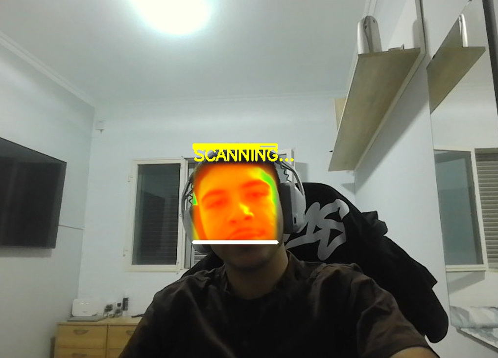

# Práctica 5: Detección y caracterización de caras

## Contenidos

- [Descripción](#descripción)
- [Configuración del entorno](#configuración-del-entorno)
  - [Creación del entorno](#creación-del-entorno)
- [Estructura del cuaderno y flujo general](#estructura-del-cuaderno-y-flujo-general)
- [Carga y entrenamiento del modelo](#carga-y-entrenamiento-del-modelo)
- [Detector de emociones](#detector-de-emociones)
  - [Flujo del programa](#flujo-del-programa)
  - [Ejemplo](#ejemplo)
- [Thermal Vision Filter](#thermal-vision-filter)
  - [Controles](#controles)
  - [Flujo del Programa](#flujo-del-programa-1)
  - [Ejemplo](#ejemplo-1)
- [Autoría](#autoría)
- [Fuentes y referencias](#fuentes-y-referencias)

## Descripción

Este proyecto implementa un **sistema de reconocimiento de emociones** faciales basado en visión por computador, complementado con dos aplicaciones en tiempo real: un detector de emociones con cámara y un filtro de "visión térmica" con efecto de escaneo sobre el rostro.

El modelo principal se entrena sobre un dataset de caras en escala de grises, clasificadas en 7 emociones: "angry", "disgust", "fear", "happy", "neutral", "sad" y "surprise". Usa PCA para reducir la dimensionalidad y una SVM.

## Configuración del entorno

Para la correcta ejecución de este cuaderno, se recomienda crear un entorno virtual con **Conda** donde se instalen todas las dependencias necesarias.

### Creación del entorno

Ejecutar en la **terminal** o **Anaconda Prompt**:
```bash
conda create --name VC_P5 python=3.11.5
conda activate VC_P5
pip install numpy opencv-python matplotlib scikit-learn mtcnn tensorflow jupyter
```

Estas dependencias cubren las librerías utilizadas en el cuaderno: numpy, opencv-python, matplotlib, scikit-learn (PCA, SVM, métricas, escalado, grid search) y mtcnn para la detección de caras en vídeo.​

## Estructura del cuaderno y flujo general

El cuaderno está organizado en bloques que cubren todo el pipeline, desde la carga de datos hasta las aplicaciones en tiempo real. El flujo principal es el siguiente: carga de imágenes -> preprocesado -> partición entrenamiento/test -> PCA -> normalización -> búsqueda de hiperparámetros con SVM -> evaluación -> uso en cámara.

---

## Carga y entrenamiento del modelo

Primero se **carga** el dataset recorriendo las subcarpetas de la ruta indicada. Cada imagen se lee y se redimensiona a un tamaño estándar de 96x96 píxeles, se convierte a escala de grises y se aplana en un vector de características que se almacena en X. Su etiqueta númerica correspondiente a su clase se almacena en Y.

Tras la carga de datos, se realiza la **separación de imagenes** de entrenamiento y test, reservando un 30% de los datos para la prueba. Para reducir la dimensionalidad, se aplica PCA manteniendo el 95% de la varianza. Esto consigue reducir significativamente el coste computacional, ya que el modelo selecciona únicamente las 138 características principales de las 9216 originales.

Después de aplicar PCA, se **normalizan los datos** usando MinMaxScaler() para escalar cada componente al rango [0, 1]. Esto se hace para mejorar el rendimiento, igualar la importancia de las características y para evitar problemas que pueden surgir si hay valores mucho mayores que otros.

Como clasificador se ha elegido una SVM. Esta se entrena con los siguientes hiperparámetros:
- C: [1e3, 5e3, 1e4, 5e4, 1e5]
- gamma: [0.0001, 0.0005, 0.001, 0.005, 0.01, 0.1]

Tras un proceso de **entrenamiento** que puede durar muchos minutos (), se encontrará la combinación de hiperparámetros más adecuada.

Finalmente, se **evalúa el modelo** entrenado sobre el conjunto de test. Los resultados obtenidos se muestran en un informe de precisión y recall por clase y una matriz de confusión. Estos son los resultados obtenidos:
```
Metrics
              precision    recall  f1-score   support

       angry       0.63      0.70      0.67       657
     disgust       0.80      0.68      0.73       189
        fear       0.68      0.63      0.65       495
       happy       0.72      0.63      0.67       870
     neutral       0.74      0.82      0.78       902
         sad       0.65      0.64      0.64       521
    surprise       0.83      0.85      0.84       451

    accuracy                           0.71      4085
   macro avg       0.72      0.71      0.71      4085
weighted avg       0.71      0.71      0.71      4085

Precision:  0.713, Recall:  0.712
Confusion matrix
[[462  13  39  38  49  51   5]
 [ 24 128   4  16   3   9   5]
 [ 72   7 310  22  11  52  21]
 [ 61   4  29 548 166  34  28]
 [ 34   1  16  88 743  18   2]
 [ 68   6  34  32  29 335  17]
 [ 10   1  23  13   1  20 383]]
```

## Detector de emociones

En este cuaderno se puede encontrar un detector de emociones en tiempo real que usa la cámara para aplicar el modelo entrenado a las caras. Para la detección de las caras se usa la librería MTCNN, que devuelve las coordenadas de la caja delimitadora del rostro, sobre la cual se replica el mismo preprocesado que en el entrenamiento antes de realizar la predicción.

### Flujo del programa

Primero se carga el detector facial MTCNN y se captura la imagen con cv2.VideoCapture(0).​ Entonces, se ejecuta el bucle principal en el que se captura cada frame de la cámara.

En cada frame, se buscan las caras y, si hay al menos una, se selecciona la primera detección y se extrae la región facial. A esta región se le aplica un preprocesado, pasandola a escala de grises, aplicando CLAHE para mejorar el contraste, normalización y redimensionado a TARGET_SIZE = (96, 96).

Se transforma con PCA para obtener las características principales y se aplica el modelo para conseguir la predicción y así detectar la emoción.​

Finalmente, se dibuja un recuadro alrededor de la cara detectada y se escribe el nombre de la emoción en el frame. Este bucle solo se detiene cuando el usuario pulsa la tecla "q", momento en el que se cierran las ventanas y se termina la ejecución.

### Ejemplo

**PONER EL GIF**

---

## Thermal Vision Filter

Esta aplicación de visión por computador simula una cámara térmica en tiempo real. Detecta los rostros usando MTCNN y aplica diferentes colormaps solo a la región facial, dejando el fondo en colores normales. Además, una animación de escaneo refuerza la apariencia de un visor térmico.

### Controles

- `D` - Cambiar colormap (inicia escaneo)
- `Q` - Salir

### Flujo del Programa

El programa comienza cargando el detector facial MTCNN y preparando cinco colormaps térmicos diferentes (JET, HOT, OCEAN, RAINBOW, DEEPGREEN). Una vez inicializado, espera a que aparezcas frente a la cámara.

Cuando detecta tu rostro por primera vez, inicia automáticamente un escaneo visual. Una línea blanca desciende de arriba hacia abajo sobre tu cara, revelando progresivamente el efecto térmico aplicado solo a la región facial mientras el fondo permanece en colores normales.

En cada frame del bucle principal, el programa captura la imagen de la cámara y detecta tu cara usando MTCNN. Crea una máscara elíptica alrededor del rostro detectado y la suaviza con un filtro gaussiano para conseguir bordes difusos. Luego convierte el frame a escala de grises y aplica el colormap térmico actual.

Si se está ejecutando un escaneo, el programa realiza una mezcla progresiva mostrando la línea de escaneo y una barra de progreso. Cuando no hay escaneo activo, muestra el efecto térmico completo aplicado al rostro. Cada vez que presionas la tecla 'D', cambia al siguiente colormap e inicia un nuevo escaneo que revela el efecto gradualmente.

En resumen, el programa detecta tu cara, aplica el efecto térmico solo al rostro manteniendo el fondo normal, y cada vez que cambias de colormap o apareces por primera vez, ejecuta un escaneo visual de arriba hacia abajo revelando el nuevo efecto.

### Ejemplo



---

## Autoría
Este trabajo ha sido realizado por Juan Francisco del Rosario Machin y Mario García Abellán, como parte de una práctica de procesamiento de imágenes en el entorno académico.

## Fuentes y referencias:
- Documentación oficial de OpenCV: [https://docs.opencv.org](https://docs.opencv.org)
- Consultas realizadas a [ChatGPT](https://chatgpt.com/):
    - Ayuda para elegir hiperparámetros para entrenar SVM
    - Estrategias para optimizar el procesamiento frame a frame.
    - Redactar algunas partes del README.
- [dataset emociones](https://github.com/Emilmrk/preprocessed-facial-emotions-224)